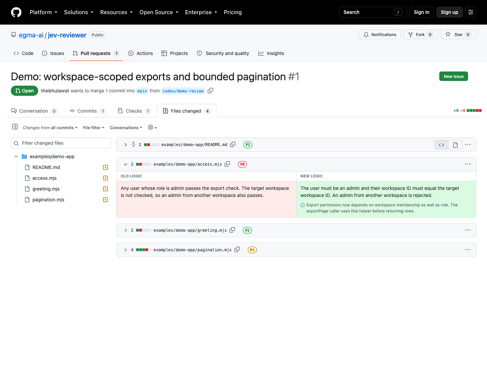

# Jev-Code-Reviewer

Most PRs that are getting generated by agent hard for human mind to comprehend as it shows up with lot of file changes at once. This is an attempt to reduce the mental burden by classifying each change in a review to P0, P1, P2. Only P0 are shown by default. The priorities are configurable. The diffs are also show using a natural language. The original code is one toggle away.

It runs on your computer, for reviewing your own coding agent's PRs, and posts nothing to GitHub.



[Watch the recording](https://github.com/egma-ai/jev-code-reviewer/blob/main/docs/demo.mp4) · [Open the demo PR](https://github.com/egma-ai/jev-code-reviewer/pull/1). The bundled recording uses real Jev classifications and labeled, prepared explanation copy ([provenance](demo/README.md)).

## Quick demo

Needs Node.js 22+.

```sh
git clone https://github.com/egma-ai/jev-code-reviewer.git
cd jev-code-reviewer
npm install
npm run demo
```

Open http://127.0.0.1:4731/demo for the replay, which makes no provider calls, or load the extension (below) and open the [demo PR's Files changed page](https://github.com/egma-ai/jev-code-reviewer/pull/1/files).

## Review your own PR

Needs the [GitHub CLI](https://cli.github.com/) signed in (`gh auth login`) and a local clone whose `origin` is the PR's repository.

```sh
npm link                 # adds the jev-reviewer command
jev-reviewer setup       # stores your keys (Jev works keyless via free classifier.dev); run it in your own terminal
jev-reviewer doctor      # checks tools, key sources, the local server, and provider access
jev-reviewer serve       # leave running
jev-reviewer analyze --pr https://github.com/OWNER/REPO/pull/123 --repo /path/to/clone
```

Then in Chrome:

1. Open `chrome://extensions`, turn on **Developer mode**, click **Load unpacked**, and pick this repo's `extension/` folder.
2. Run `jev-reviewer token | pbcopy`. In the extension popup, open **Connection**, paste, and click **Save**. It should say **Paired**.
3. Open the PR's **Files changed** page (`/pull/<n>/files`) and turn on **Show logic in place of code**.

Optional: `uv tool install graphifyy` adds a local code graph for better context. To have your coding agent run `analyze` after it opens a PR, install the [agent skill](install/README.md).

## Good to know

- **Your code leaves your machine.** `analyze` sends changed code and nearby context to the Jev provider and OpenAI. The Jev provider is [classifier.dev](https://classifier.dev)'s free tier by default (no key needed); set `TYPESAFE_API_KEY` to use TypeSafe's keyed System One endpoint instead, or point `JEV_API_URL` / `--jev-endpoint` at any System One-compatible endpoint. The extension only talks to the local server on `127.0.0.1:4731`.
- **Keys** are stored in `~/.config/jev-reviewer/credentials.json` (owner-only, not encrypted). Only the OpenAI key is required. Prefer this over exported variables, which a coding agent's shell often cannot see. Replace an OpenAI key with `node scripts/setup-keys.mjs --replace-openai`. A `CLASSIFIER_API_KEY` (classifier.dev workspace key) raises the free-tier limits when set.
- **Coverage is capped.** The first 12 change units (diff hunks) in path order are analyzed; `--max-units` allows up to 100. Files with an unanalyzed change keep GitHub's code, and the CLI and popup say how many.
- **Classic Files changed page only.** GitHub's new `/changes` page is not supported yet; switch back under your profile picture → **Feature preview**.
- **Old reports are never shown.** If the PR has newer commits, the extension keeps GitHub's code: rerun `analyze`, then click **Refresh report**.
- **Priorities mean attention, not correctness.** P0 files open by default; P1 and P2 start collapsed. Tune them by copying `config/policy.json` to `.jev-reviewer.json` in the reviewed repo, or pass `--policy`.

## Development

```sh
npm test
node scripts/test-extension.mjs   # needs Chromium and port 4731 free
```

See [architecture](docs/ARCHITECTURE.md), [demo guide](docs/DEMO.md), and [extension details](extension/README.md).

MIT.
